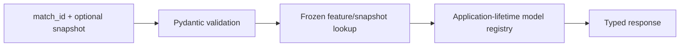

# API overview

The FastAPI service exposes the finished project’s frozen inference pipeline through versioned `/api/v1` routes. It is designed for known public StatsBomb matches already present in the target-free feature stores.

## Runtime architecture



Models, calibrators, mappers, manifests, and feature stores load once during the FastAPI lifespan. No endpoint fits, tunes, or retrains anything.

## Base URLs

| Context | URL |
|---|---|
| Local API | `http://127.0.0.1:8000` |
| Local Swagger | `http://127.0.0.1:8000/docs` |
| Local ReDoc | `http://127.0.0.1:8000/redoc` |
| Static Pages Swagger | [Open Swagger UI](swagger/index.html) |
| Static Pages ReDoc | [Open ReDoc](redoc/index.html) |

No external backend URL is currently claimed. `PUBLIC_API_BASE_URL` controls OpenAPI server metadata after a real FastAPI deployment.

## Authentication

The current read-only historical inference API has **no authentication**. It accepts no uploaded files and exposes no private data. A public deployment should add platform-level rate limits and observability; if authorization is later introduced, it must be reflected in OpenAPI and client examples.

## Supported prediction modes

- **Pre-match:** any of the 414 known match IDs with a materialized kickoff feature row.
- **In-play:** a known match ID and one of 19 frozen minutes (`0, 5, …, 90`), with `second = 0`.
- **Timeline:** all frozen snapshots for a known match.

Arbitrary new fixtures and arbitrary-second snapshots are not accepted. They require upstream history/event reconstruction with the production pipeline before inference.

## Probability semantics

All probability objects use named keys:

```json
{
  "home_win": 0.50,
  "draw": 0.25,
  "away_win": 0.25
}
```

They sum to approximately one. Model 1’s `probabilities` field is Platt calibrated. Model 3’s `probabilities` is the raw final headline; its phase-Platt alternative is returned separately because calibration improved ECE but worsened RPS.

## Static docs versus callable service

Swagger UI and ReDoc on GitHub Pages load the committed `openapi.json`. They can inspect every schema without a backend. Requests work only if the browser can reach the server listed in the schema—localhost by default, or a separately deployed Python service configured later. GitHub Pages itself never executes FastAPI.
