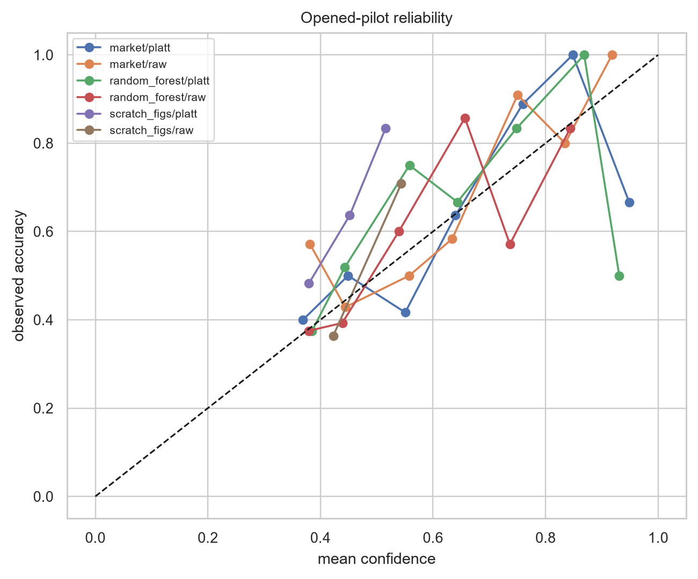

# Probability calibration

A useful football forecast must mean what it says. Among matches assigned about 70% confidence, the event should occur about 70% of the time over an appropriate population. Calibration is therefore evaluated separately from ranking and discrimination.

## Methods

Two holdout-only methods are evaluated during development:

- **Multiclass Platt:** multinomial logistic scaling over log probabilities.
- **Isotonic:** one-vs-rest monotonic regressions followed by normalization.

Neither method sees base-model training rows or final labels. Platt is fixed a priori for the one-shot final evaluation.

## Model 3 phases

Snapshot calibration uses three separate calibrators:

| Phase | Minutes |
|---|---|
| Early | `<= 30` |
| Middle | `35–60` |
| Late | `> 60` |

Rows repeat within matches, so the calibration sample is still 62 independent matches—not 1,178 independent outcomes.

## Final behavior

For Model 1 random forest, Platt improves RPS from 0.131 to 0.120 and ECE from 0.157 to 0.112. It is not uniformly beneficial: LightGBM and SVC proper scores worsen after calibration.

For Model 3 gradient boosting, phase-Platt lowers ECE from 0.112 to 0.055 but worsens RPS from 0.116 to 0.134. The API therefore returns:

- raw headline probabilities as `probabilities`;
- phase-Platt probabilities as `calibrated_probabilities`;
- an explicit flag showing that the headline field is raw.

## Reading ECE carefully

ECE depends on binning and sample size. Sparse confidence bins, a small calibration cohort, and the selected 34-match final subset all create uncertainty. RPS, log loss, Brier, ECE, and accuracy should be read together.
