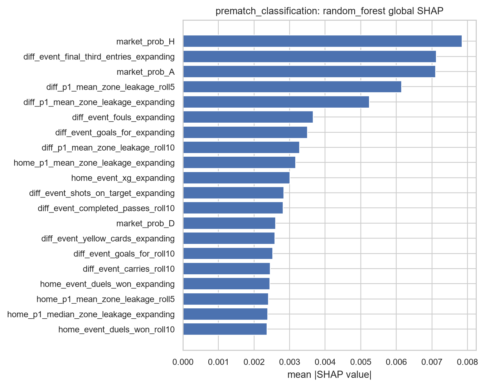
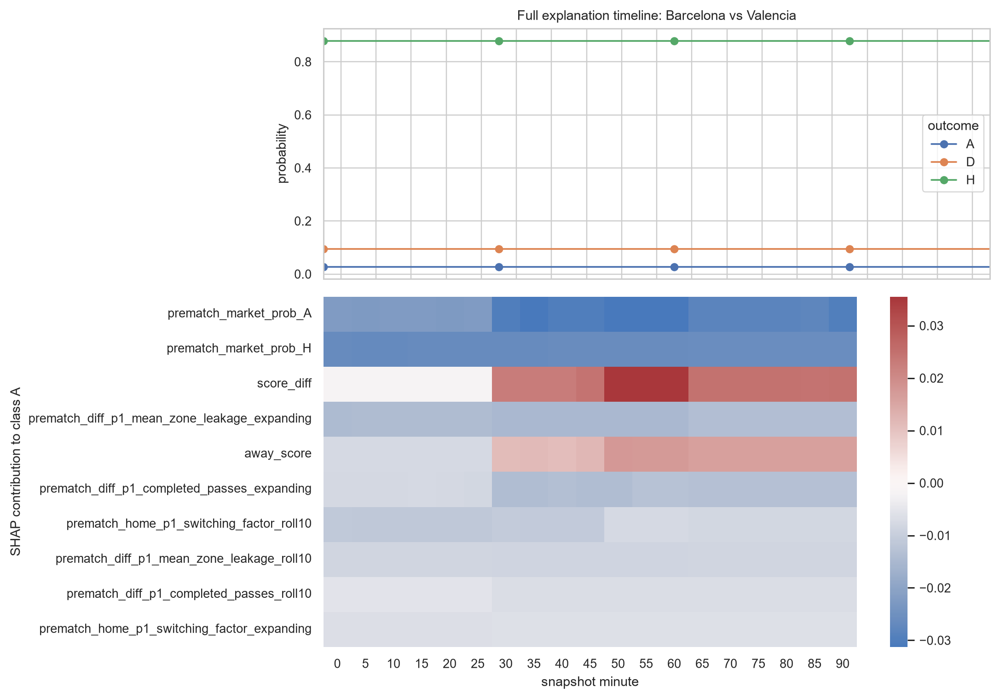

# Explainability

The project retains global, local, and temporal explanation evidence while keeping unsupported cases explicit.

## Global SHAP

TreeExplainer is run for supported random forest, XGBoost, LightGBM, and regression gradient-boosting models using documented samples. Market probabilities, score difference, and accumulated conventional/P1 histories dominate many supported models.

## Local error explanations

The ten worst rows per task are retained with local SHAP values. In the final cohort, the headline Model 1 is notably weaker on five draws than on decisive results, and its largest failures include Barcelona away losses that the model strongly favored as away wins.

Explanations describe a fitted model’s local behavior; they do not establish causal football mechanisms.

## Full-match timeline

One 19-snapshot match is exported with evolving probabilities, state, and explanation contributions. The selected Barcelona–Valencia failure remains overconfident in a home result while score state and class-specific contributions evolve.

## Why there is no public `/explain` endpoint

The headline Model 3 outcome estimator is scikit-learn multiclass `GradientBoostingClassifier`, which SHAP TreeExplainer does not support in this project environment. The repository records that limitation instead of substituting an unrelated explanation. Existing supported-model SHAP artifacts are offline research outputs, not yet a stable low-latency, model-consistent API contract.

A future explanation endpoint should be added only with explicit output semantics, runtime limits, feature-value disclosure policy, and parity tests against the offline pipeline. No fabricated explanation is returned today.
