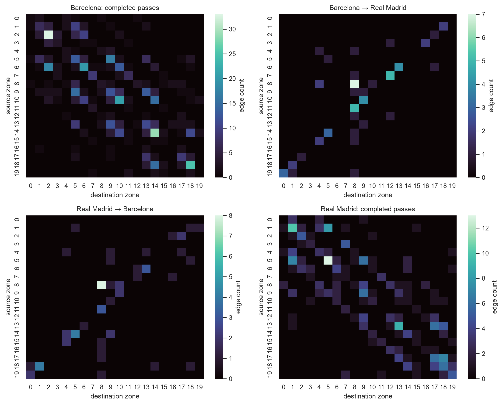
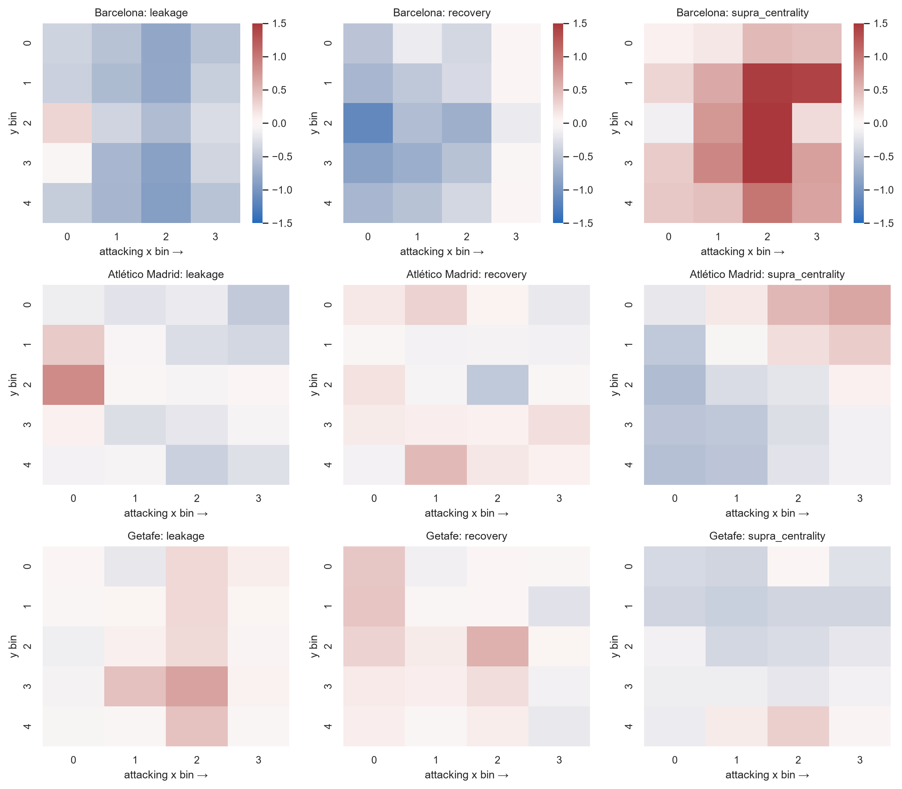

# P1 — A multilayer network framework for soccer analysis

P1 models a match as two interacting spatial passing networks rather than two isolated possession summaries. This project reproduces the method on StatsBomb La Liga data and adapts the source semantics explicitly.

## 4 × 5 pitch segmentation

The 120 × 80 StatsBomb pitch is partitioned into four x-bins and five y-bins: **20 nodes per team**. With a home and away layer, the multilayer system has 40 nodes.

## Edges and layers

- **Intra-layer:** a directed edge from the passer’s start zone to end zone for each completed pass.
- **Inter-layer:** at a same-period possession change, a directed edge from the final spatial event zone of the old possession to the first spatial event zone of the new possession.

For home/away passing matrices `Aᴴ`, `Aᴬ` and transition blocks `Cᴴᴬ`, `Cᴬᴴ`, the supra-adjacency is:

```text
        [ Aᴴ   Cᴴᴬ ]
𝒜  =    [ Cᴬᴴ Aᴬ  ]    ∈ ℝ⁴⁰ˣ⁴⁰
```

Rows are source zones and columns are destination zones.



## Metrics

The project computes the dominant **right** eigenvector `𝒜x = λx`, normalizes it to unit sum, and retains numerical residuals. For each zone:

- **network leakage:** cross-layer outgoing degree divided by total incoming pass + recovery degree;
- **recovery:** cross-layer incoming degree divided by the same incoming denominator;
- **switching factor:** half the sum of inter-layer in/out flow relative to within-layer pass in-degree over defined zones.

Zero denominators remain missing at zone level rather than being silently set to zero.

## Opta → StatsBomb adaptation

The paper studies Opta 2018/19. This project uses StatsBomb 2015/16 and the 34 available 2016/17 matches, so it is a **methodological replication**, not a numerical reproduction.

StatsBomb represents play in a team-in-possession attacking frame. Empirical orientation checks show that both sides attack toward increasing x, so there is no home/away coordinate flip. Possession identifiers and same-period event order provide the transition boundary. Late events tagged to an older possession are removed at the next boundary.

## Validation and descriptive findings

All 760 development team-match rows match the historical notebook to a largest metric difference of `2.72 × 10⁻¹⁵`; maximum eigen residual is `7.86 × 10⁻¹⁴`. Team-mean supra centrality correlates `r = 0.561` with season points across 20 teams—descriptive association, not causation.



## In forecasting

P1 match metrics are shifted before rolling/expanding histories, producing 162 network predictors. Network-only and combined groups are evaluated independently. Their inconsistent generalization is reported as a result rather than hidden behind the domain appeal of the representation.
