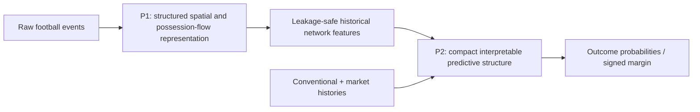

# P1 + P2 integration

The two papers contribute different layers of the project:

P1 answers **how should football interaction be represented?** P2 answers **how can several predictive rules compete while staying compact?** Their connection is tested through feature-group ablations, not assumed.

## Development ablation evidence

| Task / model | Conventional | Market | Network | Combined |
|---|---:|---:|---:|---:|
| Model 1 random forest, RPS ↓ | 0.165 | **0.155** | 0.178 | 0.169 |
| Model 1 scratch FIGS, RPS ↓ | 0.217 | 0.200 | **0.199** | 0.195* |
| Model 2 random forest, MAE ↓ | 1.256 | **1.239** | 1.283 | 1.263 |
| Model 2 scratch FIGS, MAE ↓ | 1.500 | **1.301** | 1.349 | 1.430 |

`*` The locked-candidate and feature-ablation files contain slightly different FIGS combined configurations; conclusions use the complete machine-readable outputs rather than treating the small difference as a discovery.

## What the results support

- P1 features carry interpretable spatial and possession-flow information.
- Network-only FIGS can be competitive with other FIGS feature groups for Model 1 validation.
- Market-only features are strongest for the principal random-forest validation comparisons.
- Adding P1 to conventional/market features does not demonstrate a reliable lift.
- FIGS offers a transparency–accuracy trade-off, with its strongest empirical niche late in matches.

## What the results do not support

The project does **not** claim that P1 improves FIGS overall, that network centrality is causal, or that a compact model should beat the betting market. The public site keeps the negative ablation result because it is central to the scientific value of the work.
