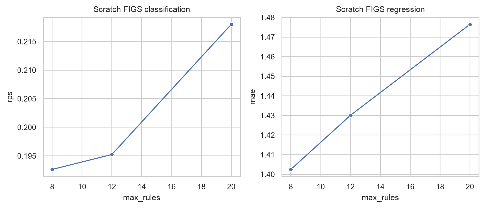

# P2 — Fast Interpretable Greedy-Tree Sums

Fast Interpretable Greedy-Tree Sums (FIGS) fits a **sum of small trees**. Trees compete for splits globally, allowing a compact additive structure that is often easier to inspect than a large forest or boosting ensemble.

## Core algorithm

At every step FIGS considers:

1. every current leaf in every existing tree;
2. a fresh tree root;
3. every candidate feature and threshold.

For tree `k`, residual targets exclude all other trees. The best single impurity reduction across all candidates is accepted. Because all leaves return to the competition after each split, an earlier tree can be revisited after another tree starts.

```text
F(x) = T₁(x) + T₂(x) + … + Tₖ(x)
```

A global split budget—not a per-tree depth alone—controls complexity and interpretability.

## Regression and classification

- Regression uses residualized least-squares stumps and sums scalar tree outputs.
- Multiclass classification follows the reproducible official reference behavior: residualized one-hot least squares produces class-score vectors, then softmax produces probabilities.

The paper prose uses a Gini shorthand, but Gini is not defined for the continuous residual vectors used after the first additive component. The implementation documents this fidelity nuance rather than pretending the descriptions are identical.

## Backfitting

Optional post-structure backfitting holds splits fixed and alternates leaf-value updates conditional on the other trees. The tests verify that this step does not increase training squared error.

## Scratch coursework implementation

Production code in `src/ml_project/figs.py` never imports `imodels`. Tests cover:

- the paper-style regression toy;
- an existing-tree revisit after a new tree begins;
- deterministic multiclass probabilities and class shape;
- a valid zero-rule constant estimator;
- non-increasing backfitting error;
- parity to an independent `imodels` test reference within `10⁻¹²` on fixed toys.



## Football results

More rules do not monotonically improve temporal validation. Scratch FIGS is not uniformly more accurate than ensembles, but its small structures remain auditable and its strongest final behavior appears in late-match phase-calibrated classification.

Machine-readable exported structures are retained in:

- `outputs/tables/models/scratch_figs_classification_rules.json`
- `outputs/tables/models/scratch_figs_regression_rules.json`
