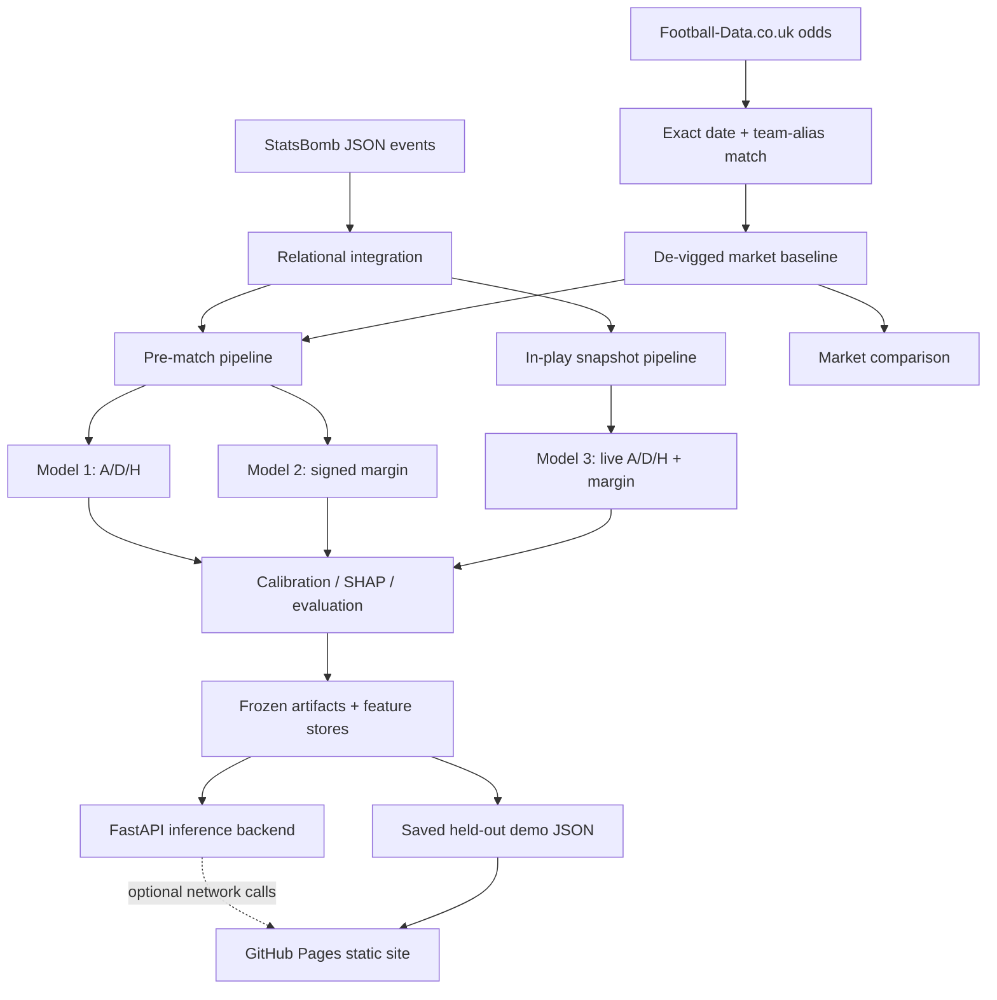

# Architecture

The same repository contains the research pipeline, frozen inference service, and static documentation. Their runtime responsibilities are deliberately separated.

## Training-time components

Training-time code acquires and normalizes source data, reconstructs P1 networks, builds shifted histories, materializes exact snapshots, fits locked candidates, learns calibrators and margin mappers, computes uncertainty, and exports results. The one-shot final evaluator now refuses to run because the permanent marker proves the sealed cohort has already been opened.

These stages are intentionally absent from documentation deployment and API startup.

## Inference-time components

The API reads two target-free stores:

- `outputs/features/prematch_features.parquet` — one row per known match and the exact ordered 391-feature vector used for Models 1 and 2.
- `outputs/snapshots/snapshot_features.parquet` — 19 rows per known match and the exact ordered 507-feature vector used for Model 3.

Eight frozen objects—four predictors and their applicable calibrators/mappers—load once during the FastAPI lifespan. Requests identify a known match and snapshot; callers cannot inject arbitrary features or files.

## Static Pages components

GitHub Pages receives only the output of `mkdocs build`: Markdown documentation, generated OpenAPI JSON, selected plots, a small report PDF, and static replay JSON. It cannot import Joblib artifacts or run Python. Swagger UI and ReDoc are browsers for the schema; “Try it out” needs the separately running backend.

## Market branch

Decimal B365 odds become raw implied probabilities `1 / odds`. Dividing by their sum removes the overround and yields the de-vigged market H/D/A baseline. Scores and match statistics are never odds-join inputs. The market is both a benchmark and, in defined feature groups, an allowed pre-match predictor.
