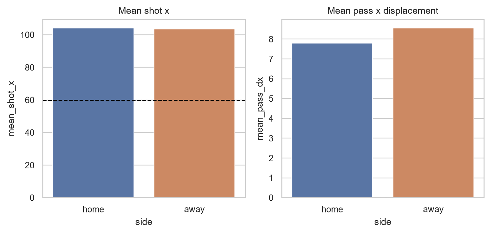

# Dataset

## Coverage

| Source | Coverage used | Role |
|---|---:|---|
| StatsBomb Open Data | 414 matches, 1,420,167 events | Fixtures, teams, lineups, event streams, locations, exact timestamps |
| La Liga 2015/16 | 380 complete fixtures | Development backbone |
| La Liga 2016/17 | 34 available Barcelona-centred fixtures | Chronologically later final cohort |
| Football-Data.co.uk SP1 | Matching B365 H/D/A odds for 414/414 fixtures | Market features and benchmark |

The normalized store also contains 14,899 match-player lineup rows, 657 observed players, and 23 teams. The selected competition-seasons have no StatsBomb 360 files; the repository retains an empty typed table and an availability manifest instead of synthesizing data.

## Relational layer

The main tables are competitions, matches, teams, players, lineups, events, odds, integrated matches, team aliases, and join diagnostics. Targets are separated into development and once-opened final tables. See the [full data dictionary](../data_dictionary.md).

## Odds integration

The match is exact on:

1. cleaned match date;
2. explicit home-team alias;
3. explicit away-team alias.

There are no fuzzy joins, duplicate keys, unmatched fixtures, or score-based keys. For decimal odds `oₖ`, the pipeline computes `qₖ = 1 / oₖ` and `pₖ = qₖ / Σq`, retaining both the original odds and the de-vigged probabilities.

## Coordinate convention

StatsBomb events use a team-in-possession attacking orientation. Both home and away shots begin near the attacking goal and both sides have positive mean pass displacement, so the pipeline does not apply a home/away flip.

## Public-release limitations

The 2016/17 source is not a full 380-match league season. Historical rolls in that season therefore omit non-exposed fixtures, and the final label balance and opponents are selection-shifted toward Barcelona. This cannot be repaired by a different model; it requires more complete later-season data under an appropriate licence.
