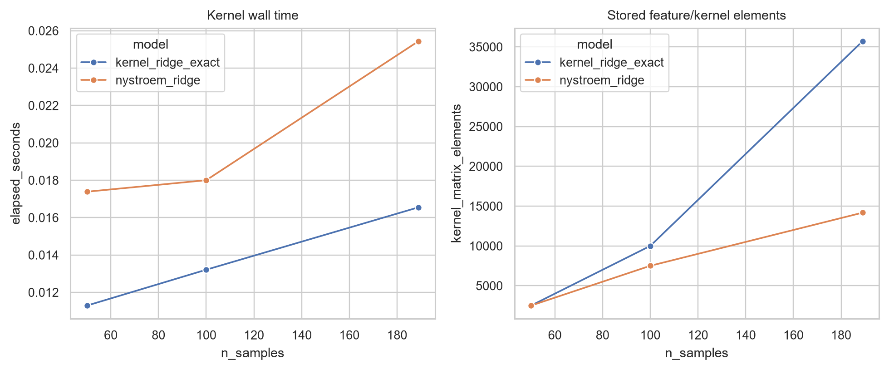

# Compute and scaling

The final project measures wall time and peak resident memory for model fitting rather than treating resource cost as an afterthought.

## Observed scale

- Instrumented development model fitting totals about 103 seconds.
- Final refitting totals about 77 seconds.
- Observed process RSS remains below 560 MB.
- The API loads selected frozen artifacts and target-free stores; it performs no fitting.

These numbers describe the supplied machine and small one-season development set. They are useful engineering evidence, not portable performance guarantees.

## Kernel scaling

Exact kernel ridge forms an `n × n` Gram matrix and has quadratic storage. At `n = 189`, the measured representation contains 35,721 elements. Nystroem uses an `n × m` representation—14,175 elements at `m = 75`—and becomes more attractive as seasons accumulate even when wall times look similar at this scale.

## P1 cost

P1 reconstruction takes about 8.4 minutes for 414 matches on the supplied machine. The cost comes from boundary-aware possession segmentation, block construction, and per-match eigensystems. Persisted matrices and metrics prevent repeated work during model development, API startup, and documentation builds.

## Documentation and inference cost controls

- Pages CI regenerates small JSON, Markdown, figures, and OpenAPI only.
- The final evaluator is never called from CI.
- Model files are not copied into `docs/`.
- FastAPI loads predictors once during lifespan rather than once per request.
- The timeline endpoint predicts 19 rows in batches.

The optional Docker image copies only the four public predictors, their calibrators/mappers, manifests, and two target-free feature stores—not raw events or the full experimental archive.
