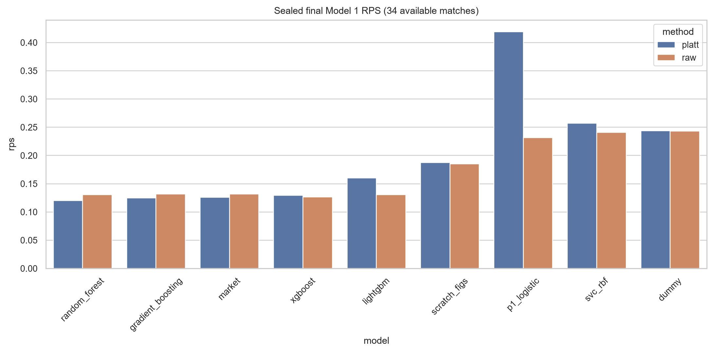
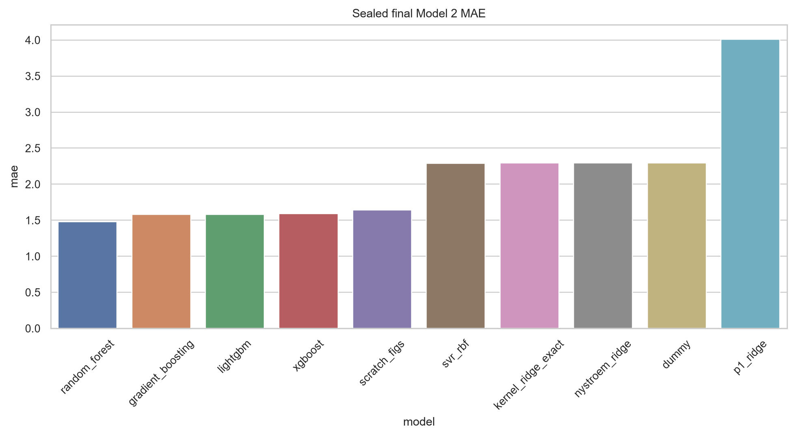
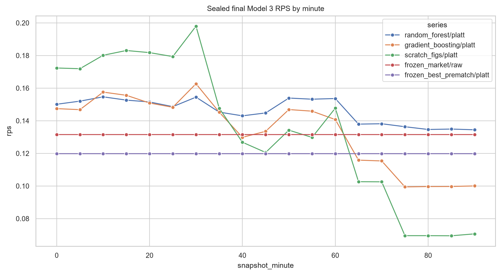

# Final results

The final evaluation contains 34 chronologically later StatsBomb 2016/17 matches and 646 five-minute snapshots. All tables below are generated from the final CSV artifacts by `scripts/build_docs_data.py`; they should not be edited manually.

  
Model 1 RF + Platt<strong>0.120</strong>RPS

  
Raw market<strong>0.131</strong>RPS

  
Model 2 RF<strong>1.479</strong>MAE goals

  
Model 3 GB raw<strong>0.116</strong>overall RPS

!!! warning "Historical point estimates, not a deployment guarantee"

    The 34 final matches are Barcelona-centred and confidence intervals are wide. The paired Model 1 improvement over the raw market crosses zero. Results describe one historical open-data backtest; they do not demonstrate profitability or stable future superiority.

--8<-- "docs/results/generated_metrics.md"

## Reading the tables

- Lower is better for RPS, log loss, Brier, ECE, MAE, and RMSE.
- `converted_rps` evaluates probabilities derived from a margin model’s scalar output.
- Model 3 intervals resample whole matches, not individual snapshots.
- `platt` for Model 3 is phase-specific; it can improve ECE while worsening RPS.

Machine-readable sources live in `outputs/final_evaluation/`; the permanent `FINAL_TEST_OPENED.json` marker prevents rerunning the one-shot evaluator.
